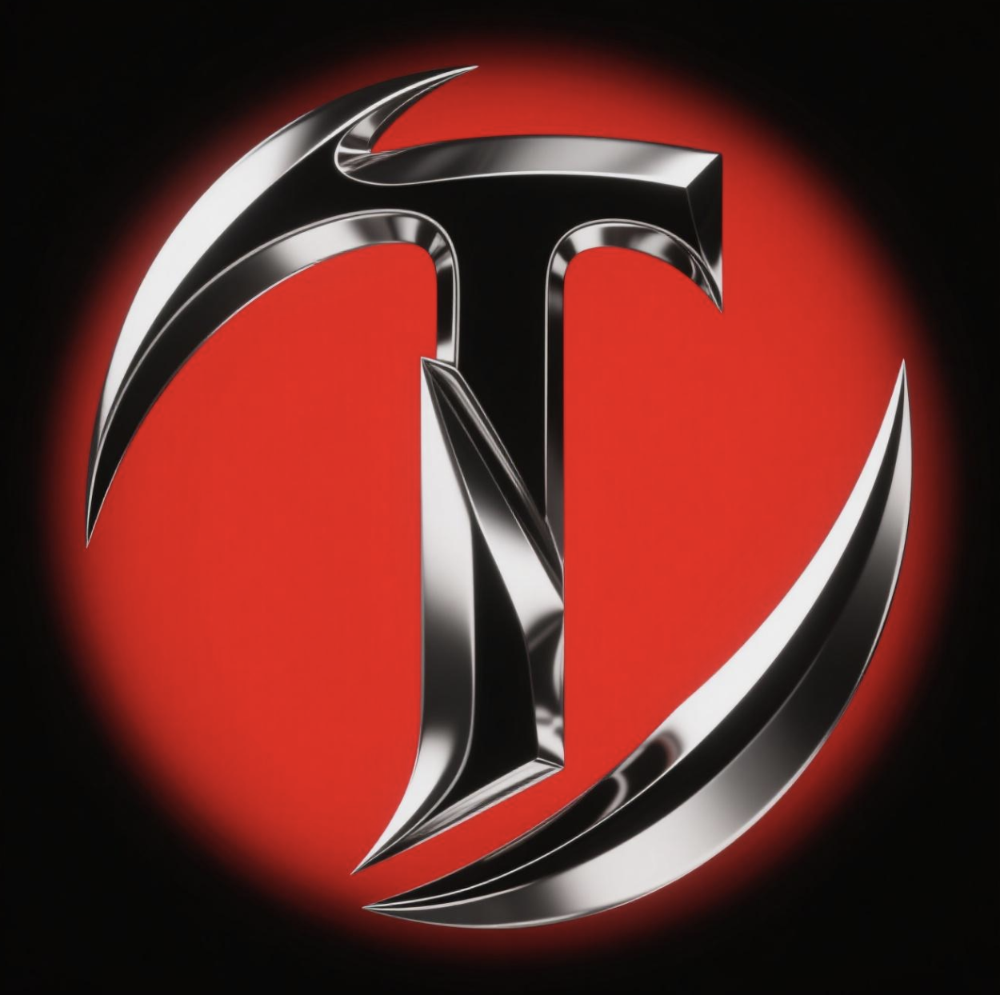

# Pump Tournament

<div align="center">
  

  [Official Website](https://www.pumptm.online) | [Twitter](https://x.com/TournamentPump)
</div>

## Project Overview

Pump Tournament is a Web3 social gaming platform built on the Solana blockchain, centered around pixel-style multiplayer real-time shooting battles accessible directly via browsers, requiring no downloads. Players engage in smooth, visually stunning battles, picking up advanced weapons and utilizing health regeneration mechanics, while earning $PTM token rewards through in-game challenges, leaderboards, and referral programs.

The project adopts a 100% Pump.fun fair launch, ensuring no presale or team allocation, with all tokens distributed via community-driven mechanisms. Pump Tournament harnesses real-time all-channel chat and player governance to create an open, transparent, and vibrant gaming ecosystem.

## Core Features

- **Browser-Based Battles**: Instant-access pixel-style multiplayer battles with silky-smooth controls, requiring no downloads
- **Dynamic Token Rewards**: Earn $PTM through victories, community interactions, and referrals, sustained by a buyback wallet
- **Vibrant Social Experience**: Real-time all-channel chat, leaderboards, and cross-platform sharing foster player connections
- **Solana Technical Advantage**: High throughput and low fees deliver seamless real-time battles and on-chain reward distribution
- **Fair Launch Mechanism**: 100% Pump.fun fair launch ensures transparent token distribution and dynamic reward optimization

## Technology Stack

- **Frontend**: Next.js, React, TypeScript, TailwindCSS
- **Game Engine**: Phaser.js for browser-based 2D games
- **Blockchain**: Solana for high-speed, low-cost transactions
- **Real-Time Communication**: Socket.IO for chat and game state synchronization
- **Token**: $PTM using Solana SPL Token standard

## Code Examples

### Game Component

```typescript
// src/components/GameComponent.tsx
'use client'

import { useEffect, useRef } from 'react'

export default function GameComponent() {
  const gameRef = useRef<HTMLDivElement>(null)

  useEffect(() => {
    if (typeof window !== 'undefined') {
      // Dynamic import for Phaser to avoid SSR issues
      import('phaser').then((Phaser) => {
        if (gameRef.current) {
          // Game configuration
          const config = {
            type: Phaser.AUTO,
            width: '100%',
            height: '100%',
            backgroundColor: '#000',
            parent: gameRef.current,
            physics: {
              default: 'arcade',
              arcade: {
                gravity: { y: 0 },
                debug: false
              }
            },
            scene: {
              preload: preload,
              create: create,
              update: update
            }
          }

          // Game instance
          const game = new Phaser.Game(config)
          
          // Scene functions
          function preload(this: Phaser.Scene) {
            // Game asset loading
          }

          function create(this: Phaser.Scene) {
            // Game initialization
          }

          function update(this: Phaser.Scene) {
            // Game loop logic
          }
        }
      })
    }
  }, [])

  return (
    <div ref={gameRef} className="w-full h-full" />
  )
}
```

### Solana Blockchain Integration

```typescript
// src/blockchain/solana.ts
import { Connection, PublicKey, Transaction } from '@solana/web3.js'
import { createTransferInstruction } from '@solana/spl-token'

// Connect to Solana network
export const connectToSolana = (network: 'mainnet-beta' | 'devnet' | 'testnet' = 'devnet') => {
  const endpoint = getEndpoint(network)
  return new Connection(endpoint, 'confirmed')
}

// Connect wallet
export const connectWallet = async () => {
  if (typeof window !== 'undefined' && 'solana' in window) {
    const solana = (window as any).solana
    try {
      const response = await solana.connect()
      console.log('Wallet connected with public key:', response.publicKey.toString())
      return response.publicKey.toString()
    } catch (error) {
      console.error('Error connecting to wallet:', error)
      throw error
    }
  } else {
    throw new Error('Solana wallet adapter not found! Please install Phantom or Solflare extension.')
  }
}

// Send PTM rewards
export const sendPTMRewards = async (
  connection: Connection,
  senderWallet: any,
  receiverAddress: string,
  tokenMintAddress: string,
  amount: number
) => {
  // Token reward logic
}
```

## System Architecture

Pump Tournament uses a server-client architecture with WebSockets for real-time multiplayer gaming:

1. **Game Initialization**:
   - Client loads game assets and connects to WebSocket server
   - Player connects and authorizes via Solana wallet (e.g., Phantom)

2. **Real-time Game Flow**:
   - Server maintains all player states and broadcasts updates
   - Client renders game scenes, handles user input, and simulates physics
   - Player actions, bullet shots, and damage calculations are synchronized through Socket.IO

3. **Blockchain Integration**:
   - Game achievements (kills, victories) trigger PTM token rewards
   - On-chain transactions for token transfers, skin purchases, and governance voting

4. **Social Features**:
   - Global chat updates in real-time via WebSockets
   - Leaderboard data refreshes hourly from server

## Getting Started

### Prerequisites

- Node.js 16+ and npm/yarn
- A modern web browser
- Solana wallet (Phantom or Solflare recommended)

### Installation

1. Clone the repository
```bash
git clone https://github.com/yourusername/pump-tournament.git
cd pump-tournament
```

2. Install dependencies
```bash
npm install
```

3. Create a `.env.local` file using the environment example file

4. Run the development server
```bash
npm run dev:all
```

5. Open [http://localhost:3000](http://localhost:3000) in your browser

## Project Roadmap

- **Q2 2025**: Project Initiation - Core game mechanics and community building
- **Q3 2025**: Testing Phase - Beta tournaments and technical optimization
- **Q4 2025**: Mainnet Launch - $PTM token on Solana mainnet via Pump.fun
- **Q1 2026**: Ecosystem Expansion - New game modes and Solana ecosystem partnerships
- **Q2 2026**: Continuous Innovation - AI features and global promotion

## Community & Support

- [Official Website](https://www.pumptm.online)
- [Twitter](https://x.com/TournamentPump)
- [Discord](https://discord.gg/pumptournament)

## License

This project is licensed under the MIT License - see the LICENSE file for details.

---

Built with ❤️ by the Pump Tournament Team 